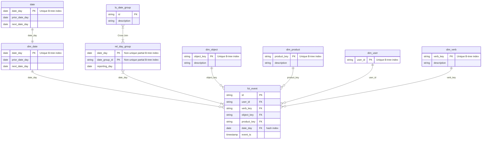

# Data Model

## Installation/Development
If you'd like to test out the code yourself, please take a look at [INSTALLATION.md](./INSTALLATION.md)

## Entity Relationship Diagram


## Analytics Answers

#### Request 1
How many users with more than 5 events last week by product?

#### Assumptions
I took the request to mean 5 distinct user and product combinations within the week prior to today's date are the filtering criteria

#### Answer
```sql
SELECT f_ev.user_id,
   f_ev.product_key,
   COUNT(DISTINCT f_ev.id) AS event_cnt
FROM fct_event AS f_ev
INNER JOIN rel_date_group AS rdg
    ON f_ev.date_day = rdg.date_day
        AND rdg.date_group_id = 'lw'
        AND rdg.reporting_day = CURRENT_DATE
GROUP BY f_ev.user_id,
   f_ev.product_key
HAVING COUNT(DISTINCT f_ev.id) > 5
```
<br><hr>

#### Request 2
How many events per user per product last week?

#### Assumptions
I took the request to mean any distinct user and product combination within the week prior of today's date should be counted and summed.

#### Answer
```sql
SELECT f_ev.user_id,
   f_ev.product_key,
   COUNT(DISTINCT f_ev.id) AS event_cnt
FROM fct_event AS f_ev
INNER JOIN rel_date_group AS rdg
    ON f_ev.date_day = rdg.date_day
        AND rdg.date_group_id = 'lw'
        AND rdg.reporting_day = CURRENT_DATE
GROUP BY f_ev.user_id,
   f_ev.product_key
```
<br><hr>

#### Request 3
How many 'selected' verb events by product by month?

#### Assumptions
I took the request to mean filter the events to only ones with a 'selected' verb value, then count them grouped by product and month (used YYYY-MM for multi-year clarity).

Also set the date window to work within the current year with the expectation it would be adjusted or removed. 

#### Answer
```sql
WITH source AS (
    SELECT product_key,
        DATE_TRUNC('month', date_day) AS yyyymm,
        COUNT(id) AS event_cnt
        FROM fct_event AS f_ev
        LEFT JOIN dim_verb AS d_v
            ON f_ev.verb_key = d_v.verb_key
        WHERE LOWER(d_v.description) = 'selected'
            AND date_day BETWEEN DATE_TRUNC('year', CURRENT_DATE) AND DATE_TRUNC('year', CURRENT_DATE) + INTERVAL '1 year' -- could also join to dim_date for start/end dates
        GROUP BY product_key, 
            yyyymm
),
final AS (
    SELECT source.*,
        d_p.description
        FROM source
        INNER JOIN dim_product AS d_p
            ON source.product_key = d_p.product_key
)
SELECT description AS product,
    to_char(yyyymm, 'YYYY-MM') AS yyyymm,
    event_cnt
FROM final
ORDER BY product ASC,
    yyyymm ASC
```
<br><hr>

#### Request 4
How many overall events by user last month segmented by verbs?

#### Assumptions
I took the request to mean count and sum any event grouped by user and verb that occurred in the month prior to today's date.

#### Answer
```sql
WITH source AS (
    SELECT f_ev.user_id,
    f_ev.verb_key,
    COUNT(DISTINCT f_ev.id) AS event_cnt
    FROM fct_event AS f_ev
    INNER JOIN rel_date_group AS rdg
        ON f_ev.date_day = rdg.date_day
            AND rdg.date_group_id = 'lm'
            AND rdg.reporting_day = CURRENT_DATE
    GROUP BY f_ev.user_id,
    f_ev.verb_key
),
final AS (
    SELECT source.user_id, -- would replace with something more meaningful but my sample data only has user_id :)
        d_v.description,
        event_cnt
        FROM source
        LEFT JOIN dim_user AS d_u
            ON source.user_id = d_u.user_id
        LEFT JOIN dim_verb AS d_v
            ON source.verb_key = d_v.verb_key
)
SELECT *
    FROM final
```
<br><hr>

#### Other questions that can be answered
1. Year over year comparisons become easy as an analyst is able to grab each year's dataset