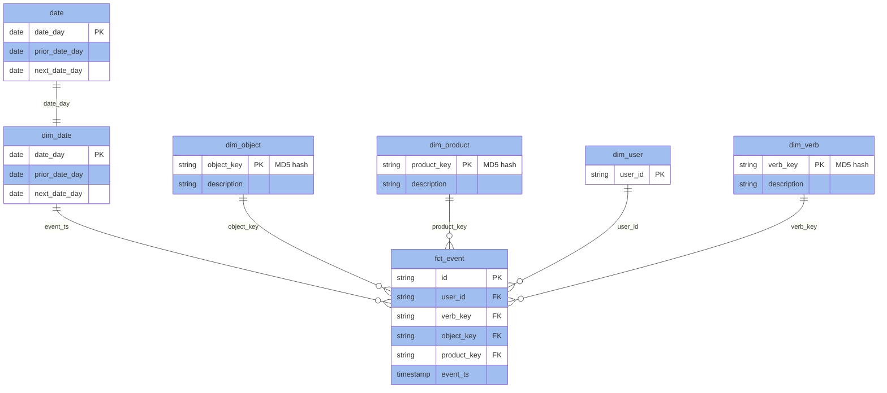

# Data Model
## Purpose 
Document and highlight areas of knowledge surrounding SQL, data modeling, and data engineering.

`Some things like profile names and environment setup were kept vague/simple on purpose to keep focus on the intent of the exercise.  These would obviously be different in a production setting.
`

## Requirements
- admin priveleges to the target installation machine
- [uv](https://docs.astral.sh/uv/) - Python environment/dependency management
- [docker desktop](https://www.docker.com/products/docker-desktop/) - deployment for local postgres instance

## Setup
### Configure your local virtual environment
```sh
uv sync
```

### Setup environment variables
```sh
# navigate to project_root if needed
cp .env.sample .env
# Modify the .env file contents to match your target profiles.yml user credentials for the local Postgres instance.
```

### Start Postgres and Adminer
```sh
# navigate to project_root if needed
docker compose up -d
```

### Seed the database
```sh
# navigate to project_root if needed
cat .docker/postgres/seed.sql | docker exec -i postgres psql -h localhost -U postgres -f-
```

### Time for dbt
```sh
# navigate to project_root/dwh
dbt seed
dbt run
dbt test
```

Entity Relationship Diagram
